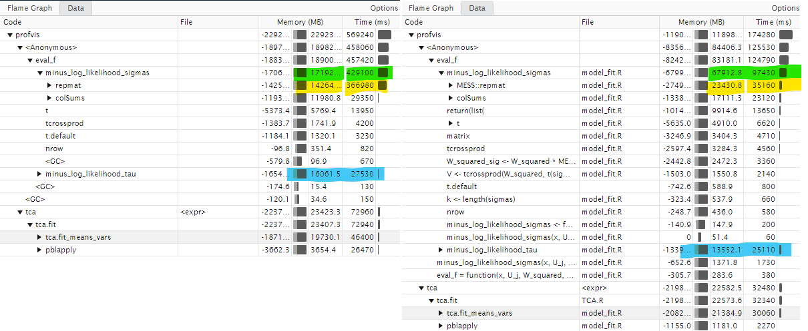

```{r, include = FALSE}
knitr::opts_chunk$set(
  collapse = TRUE,
  eval = FALSE,
  comment = "#>"
)
```

# Synopsis
* `{TCA}` is a great package. But it is running unexpectedly slowly. A 
moderately sized project (400,000 features * 1000 Samples * 6 Cell Types, 
`vars.mle = FALSE`) couldn't converge after 10 hours and hit out of memory error 
with 120GB of RAM.  
* After learning about how to use `TCA::tca()` correctly and some optimization,
we can achieve at least **13.3x** increase in speed and **2x** decrease in 
memory usage comparing to running `TCA::tca()` version 1.2.1 sequentially. 
On Windows computers, `TCA::tca()` version 1.2.1 with `parallel = TRUE` is likely
to be even slower than sequential runs in certain situations (See "Other findings").  
* In addition to the optimization, added `split_input()` to shuffle the features 
before splitting them row-wise and `tca_split()` as a wrapper to run 
`TCA::tca()` in parallel over the independent chunks of X.  

# Methods
* Use the `TCA::test_data()` function to simulate data under different
scenarios  
* Profile `TCA::tca()` fits with `profvis::profvis()` and identify bottlenecks    
* Create replicates of fit results from `{TCA}` version 1.2.1 as test fixtures 
before any changes  
* Make small changes, fit the model, and test if all the fit results are within 
machine tolerance of differences with the test fixtures  
* Profile the modded version under sequential, `vars.mle = TRUE`, `refit_W = TRUE`,
`TCA::tcareg()` fit, and parallel runs  
* Add unit tests to any new functions  

# Results
* The results of the modifications passed all the included unit tests and generated 
estimates within machine tolerance of the fit produced by version 1.2.1 using 
the same seed.  

## Sequential
* After modifications, running sequentially, we achieved a 
<span style="background-color:#26d800">**6x**</span> speed up in a 
simulation (Fig 1).  

  

* The major source of speed up achieved is from replacing the `data.frame()`, 
`lm()`, and `anova()` calls with `RcppEigen::fastLm()` and a minimal 
implementation of the partial F-test with `./R/Utils.R/fastLM_ftest`. This also 
helped with <span style="background-color: #f8e600">memory usage by 2x</span>. 
This is potentially an unsafe change. But the risk is very small because    
  + The constrained optimization step before `fastLm()` has internal checks for 
  matrix positive definiteness. Indeed, testing using rank deficient C1 and C2 
  matrices tripped the matrix positive definite checks before `fastLm()` is even
  called.  
  + `RcppEigen::fastLm()` [returns the correct values for rank deficient matrices](https://search.r-project.org/CRAN/refmans/RcppArmadillo/html/fastLm.html),
  and we can then use `anyNA()` to check for `NA` of p-values for gamma hats if
  the constrained optimization step didn't throw an error.  
  + `NA` is already expected to be taken care of by users.  
  + For 5 repetitions, the returned estimates are the same between the `fastLm()` 
  version and `TCA::tca()` version 1.2.1.  
  + Since it looks like `{TCA}` is only running partial F-tests between 2 models, 
  we don't need the extra information of `lm()` objects or the checks and 
  formatting of `stats::anova()` calls. Implementing a minimal version of 
  the partial F-test helped reduced fit time.  
  + We can also use `lm.fit()` instead of `RcppEigen::fastLm()`. `lm.fit()` comes 
  with more safety checks and probably only slightly slower than `fastLm()`. 
  But `{RcppEigen}` is so popular that it is probably already installed on most 
  machines so let's stay with `fastLm()` for now.  
* The second source of speed up comes from replacing `pracma::repmat()` calls 
with `MESS::repmat()`, which directly calls C codes. This change helps because 
the optimization steps repeatedly calls on `pracma::repmat()`. This reduced the 
`tca.fit_means_vars()` times by <span style="background-color: #ff5500">**1.6x**</span>.  
* The main resource consumer of the `vars.mle = TRUE` fit is from `nloptr()` to 
estimate sigma. Achieved a **3.3x** improvement through `fastLM` and replacing the 
<span style="background-color: #f8e600">replacing the `repmat()` calls </span>
(Fig 2).   



## Parallel
* Combine with the above changes and running in parallel over chunks of X,
not using the parallel parameter in `tca()`, we achieved a **13.3x** speed up 
in a simulation with `vars.mle = TRUE` (Fig 3).  


* Summarizing this [github question](https://github.com/cozygene/TCA/issues/1), 
this parallel implementation is valid because `tca()` *sort of* do not use 
information between features for the estimations.  
  + Technically, `tau_hat` is inducing dependencies among features in X if its 
  estimated from the data. But, it is just one parameter and since we have 
  so many features, the results won't change much between chunks.  
* To be even extra cautious about accuracy, which doesn't seem to be necessary,
for this very favorable speed up, we can  
  + Make sure the chunk size is big enough. This is needed to minimize the 
  overhead of parallel anyway. It is probably optimal to have the number of 
  chunks equal to the number of cores to parallel over.  
  + Randomly shuffle features into chunks.  
  + Don't estimate tau from the data. Estimating tau from already published 
  data of similar population that we are studying and using that estimate should 
  be more than enough.  
* `refit_W`, which uses information across features, is invalid for this. 
If `refit_W` is needed, run the most informative sites instead of the whole 
epi-genome and use the resulting estimated W on each chunks as described.  
* A good workflow might be to fit with the alternative optimization for model 
iteration and then fit one final fit with `vars.mle = TRUE`.  

# Changelog
[23/03/26]  

* Added wrappers for running `tca()` by chunks of matrix X in `./R/tca_split.R`.  

[23/03/25]  

* Moved some function calls outside of `minus_log_likelihood_tau()` and
`minus_log_likelihood_sigmas()` to shave off a couple of seconds through 
possible repeated calls of `nrow()` and `length()` in `nloptr::nloptr()`.  

[23/03/24]  

* Replaced all the `pracma::repmat()` calls with `MESS::repmat()` calls 
outside of the `tcareg()` related functions (because `tcareg()` is fast enough).  
* Added test for no result change from ver 1.2.1 for `vars.mle = TRUE`.  
* Added test for no result change from ver 1.2.1 for `refit_W()`.  

[23/03/23]  

* Replaced `data.frame()` calls and `lm()` calls in `./R/model_fit.R`.  
* Added `fastLM_ftest()` to `./R/utils.R` to calculate partial F-tests.  
* Added test for no result change from ver 1.2.1.  

# Other findings
* The use of the parallel parameter in `TCA::tca()` might be more situational.  
* On a Windows machine, the <span style="background-color: #26d800">overhead</span> caused by data being shuffled back and forth by PSOCK increased the fit time by **7x** in a small 
simulation.  
  


* On a Linux machine, the performance using 3 clusters is slower than the 
sequential run by **1.1x** in a simulation. However, on a HPC where small latency 
can add up or where huge data is passed to `TCA::tca()`, the data has to be 
replicated for each fork and the performance might worsen and consume much 
more memory for slower speed.  

# Profiling
* Below are **unorganized** thoughts and notes taken throughout the process.  

```{r eval = FALSE}
library(profvis) # Profiling tool
library(devtools)
library(tictoc)
near <- dplyr::near
load_all()
```

```{r}
# Simulate the data
set.seed(1234)
library(TCA) # Version 1.2.1
data <- test_data(100, 10000, 6, 1, 1, 0.01)
# tca.mdl <- tca(X = data$X, W = data$W, C1 = data$C1, C2 = data$C2)
lapply(data, dim)
```

## Windows machine
* Cluster type will be set to PSOCK. This would be the worst case scenario for
TCA since PSOCK has to shuttle data back and forth between the workers and this
massively increases the overhead. In the results below, the fit time was increased
by 7x.  

```{r, eval = FALSE} 
set.seed(1234)
# Run the data sequentially first. This is the results for ver 1.2.1.
prof_obj <- profvis({
  tca(X = data$X, W = data$W, C1 = data$C1, C2 = data$C2)
})
saveRDS(prof_obj, "./assets/1_2_1_sequential_n100_m1e5.rds")

# 1.2.1 vars.mle = TRUE
prof_obj <- profvis({
  tca(
    X = data$X, W = data$W, C1 = data$C1, C2 = data$C2,
    vars.mle = TRUE
  )
})
saveRDS(prof_obj, "./assets/1_2_1_sequential_vars.mle_n100_m1e5.rds")

# Then remove.packages("TCA") and load_all() this branch. Also run sequentially
remove.packages("TCA")
load_all()
prof_obj <- profvis({
  tca(X = data$X, W = data$W, C1 = data$C1, C2 = data$C2)
})
saveRDS(prof_obj, "./assets/modded_sequential_n100_m1e5.rds")

# modded vars.mle = TRUE
prof_obj <- profvis({
  tca(
    X = data$X, W = data$W, C1 = data$C1, C2 = data$C2,
    vars.mle = TRUE
  )
})
saveRDS(prof_obj, "./assets/modded_sequential_vars.mle.n100_m1e5.rds")

# Then test the parallel performance
prof_obj <- profvis({
  tca(
    X = data$X, W = data$W, C1 = data$C1, C2 = data$C2, parallel = TRUE,
    num_cores = 6L
  )
})
saveRDS(prof_obj, "./assets/modded_parallel_n100_m1e5.rds")

# Test the parallel performance chunked by X, vars.mle = TRUE
library(furrr)
prof_obj <- profvis({
  split_X <- split_input(X = data$X, n_chunks = 7)

  plan(multisession, workers = 7)

  res_par <- tca_split(
    X = split_X,
    W = data$W,
    C1 = data$C1,
    C2 = data$C2,
    vars.mle = TRUE,
    max_iters = 20
  )

  plan(sequential)
})
saveRDS(prof_obj, "./assets/modded_parallel_chunk_X_vars.mle_n100_m1e5.rds")
```

* The data graph shows 2x memory saving and 6x performance increase.  
```{r, eval = FALSE}
seq_1_2_1 <- readRDS("./assets/1_2_1_sequential_n100_m1e5.rds")
seq_1_2_1.mle <- readRDS("./assets/1_2_1_sequential_vars.mle_n100_m1e5.rds")
seq_modded <- readRDS("./assets/modded_sequential_n100_m1e5.rds")
seq_modded.mle <- readRDS("./assets/modded_sequential_vars.mle.n100_m1e5.rds")
seq_parallel_modded <- readRDS("./assets/modded_parallel_n100_m1e5.rds")
chunk_X_modded.mle <- readRDS("./assets/modded_parallel_chunk_X_vars.mle_n100_m1e5.rds")

# 1.2.1 vs modded
seq_1_2_1
seq_modded

# 1.2.1 vs modded mle
seq_1_2_1.mle
seq_modded.mle

# modded sequential vs parallel
seq_modded
seq_parallel_modded

#  1.2.1 vars mle vs chunk by X modded
seq_1_2_1.mle
chunk_X_modded.mle
```

## Linux machine
* The forked cluster is available on linux machines.  
```{r}
set.seed(1234)
prof_obj <- profvis({
  tca(X = data$X, W = data$W, C1 = data$C1, C2 = data$C2)
})
saveRDS(prof_obj, "./assets/linux_modded_sequential_n100_m1e5.rds")

prof_obj <- profvis({
  tca(
    X = data$X, W = data$W, C1 = data$C1, C2 = data$C2, parallel = TRUE,
    num_cores = 3L
  )
})
saveRDS(prof_obj, "./assets/linux_modded_parallel_n100_m1e5.rds")
```

* Slower by 1.08x.  
```{r}
seq_fork_modded <- readRDS("./assets/linux_modded_sequential_n100_m1e5.rds")
seq_fork_modded_par <- readRDS("./assets/linux_modded_parallel_n100_m1e5.rds")
seq_fork_modded
seq_fork_modded_par
```

# Notes
* We see that in `model_fit.R/tca_fit.R`, R is spending  
  + High peak memory and decent amount of time to call `tca.fit_means_vars()`.  
  This is the internal loop optimization of `tca()`. This is probably where the 
  bottle neck for the loop in parallel mode because the high memory overhead.  
  + High peak memory and a lot of time to call `lm()` and subsequently 
  `model.frame.default()`.  
  + The `anova.lm()` call to perform partial F tests is also taking a 
  significant amount time.   
* Let's try to replace the `data.frame()` call with a straight `cbind()` call to 
create a X matrix. Then we can use `RcppEigen::fastLm()` to directly call 
the X data matrix and the vector y.  
  + This is potentially a dangerous trade-off between speed and safety. But 
  `NA` is already expected to be taken care of by user. `{quadprog}` has 
  internal check for positive definite matrix. Furthermore, `RcppEigen::fastLm()` 
  returns the correct results for rank deficient matrix. We should be safe to 
  make this trade off. We can create a test case for this.  
  + Have to implement an `anova()` method for `RcppEigen::fastLm()`. This is 
  straightforward.  
* The `pracma::repmat()` calls are also taking a good amount of time. Looks like
the implementation in `{MESS}` accomplish the same thing but calls C code 
directly so it should be faster. This change would add up since `pracma::repmat()` 
is called a lot.  

# Replacing codes
* Warning, this might be unsafe  

## fastLm
* Replace the `data.frame()` and `lm()` call with `RcppEigen::fastLm`  
* Two code chunks to be replaced.  
```{r, eval = F}
# Before
df <-
  data.frame(y = X_tilde[, j], cbind(
    W / t(repmat(W_norms[, j], k, 1)),
    if (p2 > 0) {
      C2 / t(repmat(W_norms[, j], p2, 1))
    } else {
      C2
    },
    if (p1 > 0) {
      C1_ / t(repmat(W_norms[, j], k * p1, 1))
    } else {
      C1_
    }
  ))
mdl1.fit <- lm(y ~ ., data = df)
mdl1.coef <- summary(mdl1.fit)$coefficients
mdl1.cov.names <- colnames(df)[colnames(df) != "y"]
deltas_gammas_hat_pvals <-
  sapply(mdl1.cov.names, function(x) {
    if (x %in% rownames(mdl1.coef)) {
      return(mdl1.coef[x, "Pr(>|t|)"])
    } else {
      return(NA)
    }
  })
```

```{r, eval = F}
# After
mdl1.fit <- RcppEigen::fastLm(
  X = cbind(
    "(Intercept)" = 1.0, # <----------- Remember the intercept
    W / t(repmat(W_norms[, j], k, 1)),
    if (p2 > 0) {
      C2 / t(repmat(W_norms[, j], p2, 1))
    } else {
      C2
    },
    if (p1 > 0) {
      C1_ / t(repmat(W_norms[, j], k * p1, 1))
    } else {
      C1_
    }
  ),
  y = X_tilde[, j]
)
mdl1.coef <- summary(mdl1.fit)$coefficients
# First row is always intercept. Sacrifice some code readability here
# Sacrifice some code readability here by using -1 instead of
## `which(rownames(mdl1.coef) != "(Intercept)")`
deltas_gammas_hat_pvals <- mdl1.coef[-1, "Pr(>|t|)"]
```

Second chunk  
```{r, eval = F}
# Before
C1_alt <- C1_ / t(repmat(W_norms[, j], k * p1, 1))
for (d in 1:p1) {
  C1_null <- C1_alt[, setdiff(1:(p1 * k), seq(d, k * p1, p1))]
  df <-
    data.frame(y = X_tilde[, j], cbind(W / t(repmat(W_norms[, j], k, 1)), if (p2 > 0) {
      C2 / t(repmat(W_norms[, j], p2, 1))
    } else {
      C2
    }, C1_null))
  mdl0.fit <- lm(y ~ ., data = df)
  anova.fit <- anova(mdl0.fit, mdl1.fit)
  gammas_hat_pvals.joint[d] <- anova.fit$`Pr(>F)`[2]
}
```

```{r, eval = F}
# After
for (d in 1:p1) {
  mdl0.fit <- RcppEigen::fastLm(
    X = cbind(
      "(Intercept)" = 1.0, # <----------- Remember the intercept
      W / t(repmat(W_norms[, j], k, 1)),
      if (p2 > 0) {
        C2 / t(repmat(W_norms[, j], p2, 1))
      } else {
        C2
      },
      #### Used to be `C1_null` and `C1_alt`. Removed assignment calls.
      (C1_ / t(repmat(W_norms[, j], k * p1, 1)))[, setdiff(1:(p1 * k), seq(d, k * p1, p1))]
    ),
    y = X_tilde[, j]
  )
  gammas_hat_pvals.joint[d] <- fastLM_ftest(mdl0.fit, mdl1.fit)$`Pr(>F)`
}
```

## repmat
* `pracma::repmat()` is taking a decent chunk out of the time. 
`MESS::repmat` is about 50% faster at the current dimensions.  
```{r}
use_package("MESS")
```

* Replace a bunch of `t(repmat ...)` with `MESS::repmat` to remove a `t()` call 
and use the more efficient `MESS::repmat()` call.  

* For `vars.mle = TRUE`, carefully reproduce the gradient calculation and replace
with `MESS::repmat()` as well as removing some repeated calculations.  

### minus_log_likelihood_sigmas
```{r, eval = FALSE}
# Before
return(list(
  "objective" = -0.5 * (const - sum(log(V)) - sum(U_j / V)),
  "gradient" = -(colSums(W_squared * repmat(sigmas, n, 1) * t(repmat(U_j, k, 1)) /
    repmat(V_squared, 1, k)) - colSums(W_squared * repmat(sigmas, n, 1) / repmat(V, 1, k)))
))
```

```{r}
# After
W_squared_sig <- W_squared * MESS::repmat(matrix(sigmas, nrow = 1), nrow = n, 1)
return(list(
  "objective" = -0.5 * (const - sum(log(V)) - sum(U_j / V)),
  "gradient" = -(
    colSums(W_squared_sig * MESS::repmat(matrix(U_j), ncol = k) /
      MESS::repmat(V_squared, 1, ncol = k)) -
      colSums(W_squared_sig / MESS::repmat(V, 1, ncol = k))
  )
))
```

### minus_log_likelihood_w
```{r}
# Before
V_rep <- repmat(V, 1, k)
U_i <- tcrossprod(mus, w_i) + crossprod_deltas_c2_i + tcrossprod(gammas, c1_i_) - t(x_i)
U_i_squared <- U_i**2
w_i_rep <- repmat(w_i, m, 1)
fval <- -0.5 * (const - sum(log(V)) - sum(U_i_squared / V))
gval <- colSums(w_i_rep * sigmas_squared / V_rep) + colSums(((mus + C_tilde) * repmat(U_i, 1, k) * V_rep - w_i_rep * sigmas_squared * repmat(U_i_squared, 1, k)) / repmat(V**2, 1, k))
return(list("objective" = fval, "gradient" = gval))
```

```{r}
# After
V_rep <- MESS::repmat(V, 1, k)
U_i <- tcrossprod(mus, w_i) + crossprod_deltas_c2_i + tcrossprod(gammas, c1_i_) - t(x_i)
U_i_squared <- U_i**2
w_i_rep <- MESS::repmat(matrix(w_i, nrow = 1), m, 1)
fval <- -0.5 * (const - sum(log(V)) - sum(U_i_squared / V))
w_i_rep_sig <- w_i_rep * sigmas_squared
gval <-
  colSums(w_i_rep_sig / V_rep) +
  colSums((
    (mus + C_tilde) * MESS::repmat(U_i, 1, k) * V_rep -
      w_i_rep_sig * MESS::repmat(U_i_squared, 1, k)
  ) /
    MESS::repmat(V**2, 1, k))
return(list("objective" = fval, "gradient" = gval))
```

## vars.mle = TRUE
* Not really a way to get around the `nloptr()` call that takes the majority of the
time to optimize sigma.  
* The only "improvement" that's low hanging is remove assignment calls for objects
that is used only once in the function to minimize overhead for `nloptr()`

## parallel
* Let's think about the parallel.  
* Looks like R is stopping and starting clusters multiple times.  
  + Cluster is started twice. Once for the `tca.fit_mean_vars()` and once for 
  p-values of deltas and gammas.  
  + RUNNING CLUSTER IS IN GENERALL MUCH SLOWER THAN SEQUENTIAL! This is probably
  because of overhead.
  + Make sure to only run in sequential mode. But parallel over chunks of 
  X matrix instead.  
* Add a stop for if parallel and refit_W is FALSE. We can probably remove all
the parallel to be honest and just run the codes over chunks of X.  

# Test
## fastLm
The two code chunks that were replaced has to be tested concurrently  
```{r}
data <- test_data(30, 1000, 6, 1, 1, 0.01)
C1_1 <- cbind(data$C1, data$C1)
C2_1 <- cbind(data$C2, data$C2)
tca(X = data$X, W = data$W, C1 = data$C1, C2 = data$C2)
df <- readRDS("./assets/change_1.rds")
X <- cbind("(Intercept)" = 1, df[, which(names(df) != "y")])
y <- df$y

mdl1.fit <- lm(y ~ ., data = df)
mdl1.coef <- summary(mdl1.fit)$coefficients
mdl1.cov.names <- colnames(df)[colnames(df) != "y"]
deltas_gammas_hat_pvals <-
  sapply(mdl1.cov.names, function(x) {
    if (x %in% rownames(mdl1.coef)) {
      return(mdl1.coef[x, "Pr(>|t|)"])
    } else {
      return(NA)
    }
  })

deltas_gammas_hat_pvals

mdl1.fit.1 <- RcppEigen::fastLm(
  X = X,
  y = y
)

mdl1.coef.1 <- summary(mdl1.fit.1)$coefficients
deltas_gammas_hat_pvals.1 <- mdl1.coef.1[-1, "Pr(>|t|)"]
stopifnot(all(dplyr::near(deltas_gammas_hat_pvals, deltas_gammas_hat_pvals.1)))
```

# Scrap
```{r}
library(profvis)
set.seed(1234)
data <- test_data(1000, 2000, 12, 3, 10, 0.01)

# Sequential
sim_1 <- profvis({
  tca(X = data$X, W = data$W, C1 = data$C1, C2 = data$C2)
})

# Parallel
sim_2 <- profvis({
  tca(X = data$X, W = data$W, C1 = data$C1, C2 = data$C2, parallel = TRUE, num_cores = 4L)
})
```

## fastLm
```{r}
rand_y <- rnorm(nrow(mtcars))
df <- cbind(y = rand_y, mtcars)

## lm
lm.mdl0.fit <- lm(y ~ mpg + cyl + disp, data = df)
lm.mdl1.fit <- lm(y ~ ., data = df)

## alternatives
X <- cbind("(Intercept)" = 1, as.matrix(mtcars))
X_null <- cbind("(Intercept)" = 1, as.matrix(mtcars)[, c("mpg", "cyl", "disp")])

fastLm.mdl0.fit <- RcppEigen::fastLm(
  X = X_null,
  y = rand_y
)

fastLm.mdl1.fit <- RcppEigen::fastLm(
  X = X,
  y = rand_y
)
```

```{r}
anova_obj <- anova(lm.mdl0.fit, lm.mdl1.fit)
anova_obj$F
anova_obj$`Pr(>F)`

microbenchmark::microbenchmark(
  anova(lm.mdl0.fit, lm.mdl1.fit),
  fastLM_ftest(lm.mdl0.fit, lm.mdl1.fit),
  times = 1000
)

fastLM_ftest(fastLm.mdl0.fit, fastLm.mdl1.fit)
summary(fastLm.mdl0.fit)
mdl1.fit <- fastLm.mdl0.fit
```

### Bug
```{r}
set.seed(1234)
data <- test_data(500, 5000, 6, 1, 1, 0.01)
tca.mdl <-
  tca(
    X = data$X,
    W = data$W,
    C1 = data$C1,
    C2 = data$C2
  )
```

### Positive Definite
```{r}
X <- matrix(rnorm(100), ncol = 4)
X <- cbind(X, X[, 1], X[, 2])
X
y <- rnorm(nrow(X))

df <- as.data.frame(cbind(X, y))
lm(y ~ ., data = df) |>
  summary()

library(RcppEigen)
mdl1.fit <- fastLm(X = X, y = y)

mdl1.coef <- summary(mdl1.fit)$coefficients
# First row is always intercept. Sacrifice some code readability here
# Sacrifice some code readability here by using -1 instead of
## mdl1.coef[`which(rownames(mdl1.coef) != "(Intercept)")`, "Pr(>|t|)"]
deltas_gammas_hat_pvals <- mdl1.coef[-1, "Pr(>|t|)"]
stopifnot("C1 is rank deficient" = !anyNA(deltas_gammas_hat_pvals))
```

## repmat
### tca.fit
```{r}
# tca.fit
# saveRDS(list(a = W_norms[, j], n = k, m = 1), "assets/repmat_optimize.rds")
# stop()
repmat_1 <- readRDS("assets/repmat_optimize.rds")
waldo::compare(
  t(repmat(repmat_1$a, repmat_1$n, repmat_1$m)),
  MESS::repmat(matrix(repmat_1$a), repmat_1$m, repmat_1$n)
)

t(repmat(repmat_1$a, repmat_1$n, repmat_1$m))
MESS::repmat(matrix(repmat_1$a), ncol = repmat_1$n)
waldo::compare(
  pracma::repmat(repmat_1$a, 1000, 1),
  MESS::repmat(matrix(repmat_1$a, nrow = 1), 1000, 1)
)
```

### tca.fit_means_vars
```{r}
# tca.fit_means_vars
# saveRDS(
#   list(
#     W_norms = W_norms,
#     X_tilde = W_tilde,
#     C1_tilde = C1_tilde,
#     C2_tilde = C2_tilde
#   ),
#   "assets/repmat_optimize2.rds"
# )
# stop()
repmat_2 <- readRDS("assets/repmat_optimize2.rds")
waldo::compare(
  apply(repmat_2$X_tilde, 2, function(v) {
    repmat(v, 1, 3)
  }),
  apply(repmat_2$X_tilde, 2, function(v) {
    MESS::repmat(matrix(v), ncol = 3)
  })
)
```

### minus_log_likelihood_sigmas
```{r}
# minus_log_likelihood_sigmas
# stop()

repmat_3 <- readRDS("assets/repmat_optimize3.rds")

for (i in names(repmat_3)) {
  assign(i, repmat_3[[i]])
}

gradient <- -(
  colSums(
    W_squared * pracma::repmat(sigmas, n, 1) * t(pracma::repmat(U_j, k, 1)) / pracma::repmat(V_squared, 1, k)
  ) - colSums(
    W_squared * pracma::repmat(sigmas, n, 1) / pracma::repmat(V, 1, k)
  )
)

gradient2 <- -(
  colSums(
    (
      W_squared *
        MESS::repmat(matrix(sigmas, nrow = 1), nrow = n, 1) *
        MESS::repmat(matrix(U_j), ncol = k)
    ) /
      MESS::repmat(V_squared, 1, ncol = k)
  ) -
    colSums(
      (
        W_squared *
          MESS::repmat(matrix(sigmas, nrow = 1), nrow = n, 1)
      ) /
        MESS::repmat(V, 1, ncol = k)
    )
)

W_squared_sig <- W_squared * MESS::repmat(matrix(sigmas, nrow = 1), nrow = n, 1)

gradient3 <- -(
  colSums(
    (
      W_squared_sig *
        MESS::repmat(matrix(U_j), ncol = k)
    ) /
      MESS::repmat(V_squared, 1, ncol = k)
  ) -
    colSums(
      (
        W_squared_sig
      ) /
        MESS::repmat(V, 1, ncol = k)
    )
)

waldo::compare(gradient, gradient2)
waldo::compare(gradient, gradient3)
```

### minus_log_likelihood_w
```{r}
set.seed(1234)
data <- test_data(20, 10000, 6, 1, 1, 0.01)
tca.mdl <- tca(X = data$X, W = data$W, C1 = data$C1, C2 = data$C2, refit_W = TRUE)
```

```{r}
# saveRDS(
#   list(
#     w_i = w_i,
#     w_i_rep = w_i_rep,
#     sigmas_squared = sigmas_squared,
#     V_rep = V_rep,
#     mus = mus,
#     C_tilde = C_tilde,
#     U_i = U_i,
#     k = k,
#     V_rep = V_rep,
#     U_i_squared = U_i_squared,
#     V = V
#   ),
#   "assets/repmat_optimize4.rds"
# )
# stop()

repmat_4 <- readRDS("assets/repmat_optimize4.rds")

for (i in names(repmat_4)) {
  assign(i, repmat_4[[i]])
}

V_rep2 <- MESS::repmat(V, 1, k)
V_rep <- repmat(V, 1, k)
waldo::compare(V_rep2, V_rep)

w_i_rep2 <- MESS::repmat(matrix(w_i, nrow = 1), m, 1)
w_i_rep <- repmat(w_i, m, 1)
waldo::compare(w_i_rep2, w_i_rep)

gval <-
  colSums(w_i_rep * sigmas_squared / V_rep) +
  colSums(
    (
      (mus + C_tilde) * repmat(U_i, 1, k) * V_rep -
        w_i_rep * sigmas_squared * repmat(U_i_squared, 1, k)
    ) /
      repmat(V**2, 1, k)
  )

w_i_rep_sig <- w_i_rep * sigmas_squared
gval2 <-
  colSums(w_i_rep_sig / V_rep) +
  colSums((
    (mus + C_tilde) * MESS::repmat(U_i, 1, k) * V_rep -
      w_i_rep_sig * MESS::repmat(U_i_squared, 1, k)
  ) /
    MESS::repmat(V**2, 1, k))

waldo::compare(gval, gval2)
```

## vars.mle = TRUE
* Not really a way to get around the `nloptr()` call that takes the majority of the
time to optimize sigma.  
* The only "improvement" that's low hanging is remove extra assignment calls
in the function to minimize overhead for `nloptr()`

```{r}
set.seed(1234)
data <- test_data(200, 5000, 6, 1, 1, 0.01)
tca.mdl <-
  tca(
    X = data$X,
    W = data$W,
    C1 = data$C1,
    C2 = data$C2
  )

sequential_vars.alt <- profvis({
  tca.mdl <-
    tca(
      X = data$X,
      W = data$W,
      C1 = data$C1,
      C2 = data$C2
    )
})

sequential_vars.mle <- profvis({
  tca.mdl <-
    tca(
      X = data$X,
      W = data$W,
      C1 = data$C1,
      C2 = data$C2,
      vars.mle = TRUE
    )
})

sequential_vars.mle2 <- profvis({
  tca.mdl <-
    tca(
      X = data$X,
      W = data$W,
      C1 = data$C1,
      C2 = data$C2,
      vars.mle = TRUE
    )
})

saveRDS(sequential_vars.mle, "./assets/sequential_n200_m1e3_vars.mle.rds")
```

```{r}
sequential_vars.mle <- readRDS("./assets/sequential_n200_m1e3_vars.mle.rds")
sequential_vars.mle
```

### Rfast::colsums
* Rfast::colsums can be faster than colSums. Use with caution. We can try to 
benchmark the fit of the results before and after the use of colsums for a 
close to realistic set of data.  
* Rfast is faster, but it doesn't reproduce the result of fit 1.2.1.  

```{r}
tm <- matrix(rnorm(25e6), nrow = 5000)

waldo::compare(
  colSums(tm),
  Rfast::colsums(tm),
  tolerance = .Machine$double.eps^0.5
)

microbenchmark::microbenchmark(
  colSums(tm),
  # Rfast::colsums(tm),
  matrixStats::colSums2(tm)
)
```

## split_input 
```{r}
data <- test_data(30, 200000, 6, 1, 1, 0.01)
split_X <- split_input(X = data$X, n_chunks = 21)
```
 
```{r}
fit1 <- tca(X = split_X[[1]], W = data$W, C1 = data$C1, C2 = data$C2, W_C1_C2 = FALSE)
fit2 <- tca(X = split_X[[2]], W = data$W, C1 = data$C1, C2 = data$C2, W_C1_C2 = FALSE)

fit_final <- purrr::map2(fit1, fit2, \(x, y) {
  rbind(x, y)
})
fit_final$mus_hat
```

## tca_split
* Split the work into small chunks and test vs running sequentially and see 
if the estimates are similar.  
* Looks like the smaller the chunks, the more the correlation between the 
sequential run and the chunked run decreases. This is probably because the 
sigmas_hat and tau_hat are estimated using information from X. More work to be 
determined to see if its a trade off between time and accuracy if we just chunk
into "small enough" chunks instead.  
* If vars.mle = TRUE, the correlation stays high (>0.95) even when chunked into 
single features/chunk.  

```{r}
library(TCA)
library(furrr)
# devtools::install_github("hhp94/TCA@profiling")

set.seed(1234)
data <- test_data(30, 10000, 6, 1, 1, 0.01)
split_X <- split_input(X = data$X, n_chunks = 10000)
split_X
dim(split_X)

plan(multisession, workers = 7)
res_par <- tca_split(
  X = split_X, W = data$W, C1 = data$C1, C2 = data$C2, vars.mle = TRUE,
  max_iters = 20
)
plan(sequential)

res_seq <- tca(X = data$X, W = data$W, C1 = data$C1, C2 = data$C2)

res_seq |> lapply(dim)
res_seq$tau_hat
res_seq_2$tau_hat

setdiff(names(res_seq), "tau_hat")
sapply(compare_fit(res_seq, res_seq_2), \(x) {
  all(x > 0.96)
})
```


 
